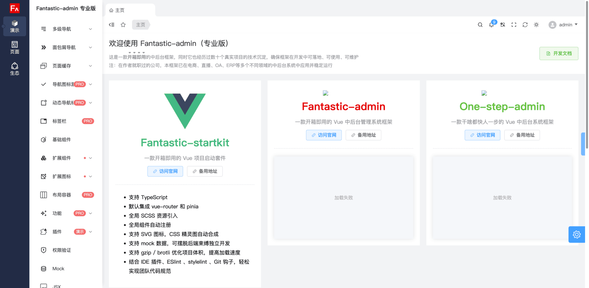
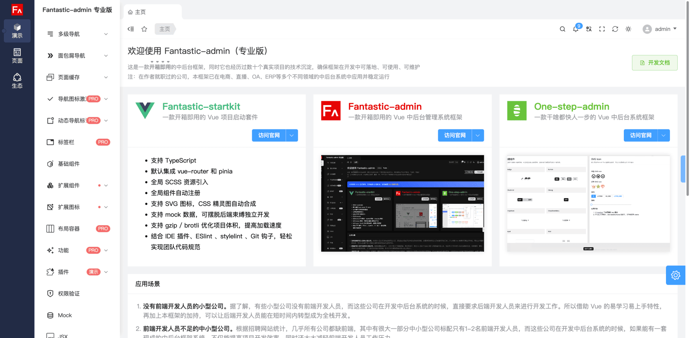
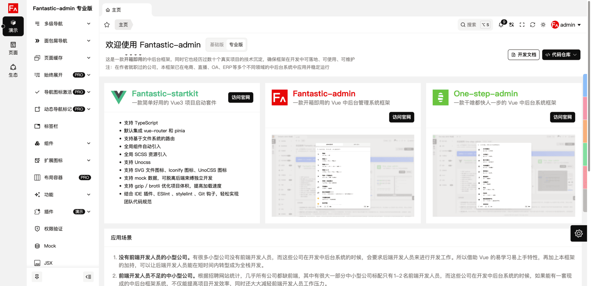

# 购买历史专业版

:::: tabs
::: tab v2 专业版

### 价格

99 元 (本价格不参与任何限时优惠活动)

### 演示

{data-zoomable}

299 元 (本价格不参与任何限时优惠活动)

### 演示

{data-zoomable}

499 元 (本价格不参与任何限时优惠活动)

### 演示

{data-zoomable}

699 元 (本价格不参与任何限时优惠活动)

### 演示

{data-zoomable}

## 购买流程

1. 请先加作者微信进行在线咨询。

2) 通过**微信**转账支付。
3) 作者将直接通过微信发送专业版源码，包含框架源码和演示源码，共 2 份压缩包文件。

## Q\&A

1. 历史版本是什么意思？

   > 本框架经过多年的迭代，目前最新主版本为 v6 ，在 v6 之前的均为历史版本。
   >
   > 历史版本均已停止更新维护，仅提供源码购买。

2. 什么人适合购买？

   > * 担心永久专业版可能不适合自己，使用最小成本体验下专业版。
   > * 不需要实时获取最新版本的用户。

3. 是否提供技术支持？

   > 仅提供开发文档支持。

4. 是否支持补差价升级到永久专业版？

   > 支持，任何时候都可以补差价升级到永久专业版。

5. 是否支持开发票？

   > 不支持。
