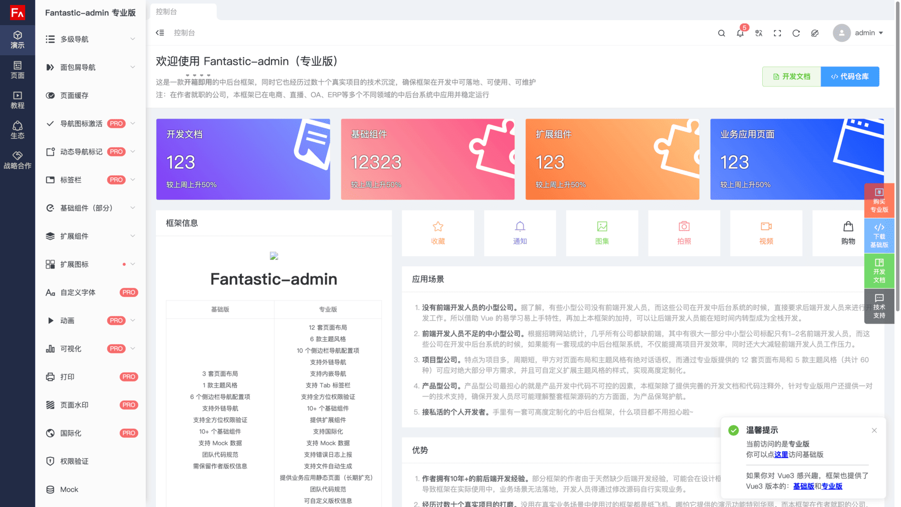

# 免费领取 v1 专业版

> v1 专业版的技术栈为 Vue2

## 领取方式

只需分别给 Github 和 Gitee 仓库点 ⭐️ ，并将 ⭐️ 截图发送给作者微信，即可免费领取 v1 专业版源码。

## Q&A

1. v1 专业版是什么意思？

    > v1 表示本框架 v1.0 的历史版本，目前已经停止更新维护。

2. 是否提供技术支持？

    > 仅提供开发文档支持，使用过程中若遇到问题，需自行解决。

## 演示

{data-zoomable}

  <a href="https://fantastic-admin.github.io/v1-pro-example/" target="_blank">访问演示地址</a>
  |
  <a href="https://fantastic-admin.github.io/v1-docs/" target="_blank">访问历史文档</a>

