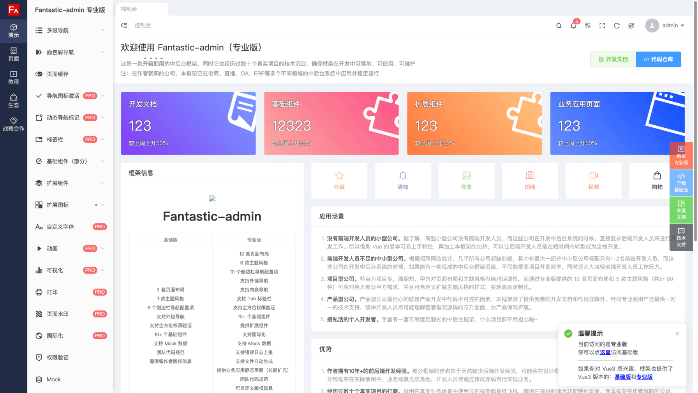

# 免费领取 v1 专业版

> v1 专业版的技术栈为 Vue2

## 领取方式

只需分别在 Github / Gitee / GitCode 给仓库分别点 ⭐️ ，并将 ⭐️ 截图发送到邮箱 `304327508#qq.com` (`#`替换成`@`)，即可免费领取 v1 专业版源码。

## Q\&A

1. v1 专业版是什么意思？

   > v1 表示本框架 v1.0 的历史版本，目前已经停止更新维护。

2. 是否提供技术支持？

   > 仅提供开发文档支持。

## 演示

{data-zoomable}
