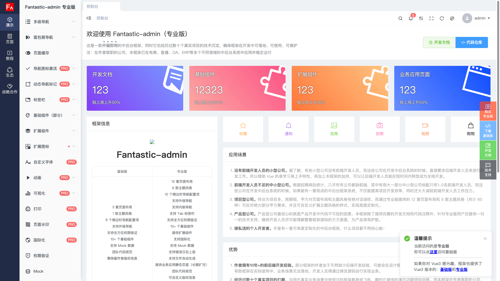

# 免费领取 Vue2 专业版

::: tip 领取方式
只需分别给 Github 和 Gitee 仓库点 ⭐️ ，并将 ⭐️ 截图发送给作者微信，即可免费领取 Vue2 专业版源码。

:::

<table style="width: 100%; display: table; margin: 1rem auto;">
  <tr>
    <td align="center">
      
    </td>
  </tr>
</table>

{data-zoomable}

::: warning 注意
- Vue2 版本已停止维护，使用过程中若遇到问题，需自行解决。
- Vue2 版本由于发布时间较早，整体设计与现有最新 Vue3 版本差异较大，使用请查阅[存档文档](https://fantastic-admin.github.io/vue2-docs/)。
:::